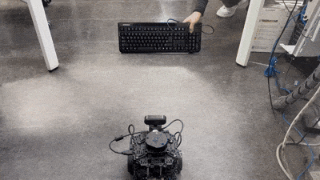
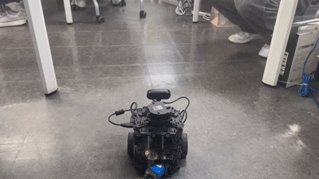

# 🤖 TurtleBot3 YOLO OCR Vision Control


This is a **vision-based TurtleBot3 control mini project** implemented using TurtleBot3 and Raspberry Pi 5 in a ROS2 Jazzy environment.

The system streams USB camera video connected to TurtleBot3 through a Flask server.
On the remote PC, OpenCV, YOLOv11, and EasyOCR are used to recognize objects and text, and TurtleBot3 is controlled by publishing velocity commands to the ROS2 `/cmd_vel` topic.

This project consists of two main functions.

1. **YOLOv11-based keyboard object tracking**
2. **EasyOCR-based Korean command recognition and robot control**

The TurtleBot3 bringup used for the basic robot operation was not written from scratch.
Instead, the official ROBOTIS `turtlebot3` package was used, specifically the `turtlebot3_bringup/launch/robot.launch.py` launch file.

<br>

## 🎥 Demo GIF

The demo videos for this project are attached as GIFs so that they can be viewed directly in the GitHub README.

### ⌨️ YOLOv11 Keyboard Tracking Demo

This demo shows TurtleBot3 recognizing a keyboard object in the camera stream using YOLOv11 and smoothly tracking it with PID control.



<br>

### 🔤 EasyOCR Command Detection Demo

This demo shows TurtleBot3 recognizing Korean text commands using EasyOCR and performing movement commands such as forward, backward, left turn, right turn, and stop.



<br>

## 📌 1. Project Overview

### Project Period

2026.05.13 ~ 2026.05.14

* **Robot Platform:** TurtleBot3
* **SBC:** Raspberry Pi 5
* **ROS Version:** ROS2 Jazzy
* **Language:** Python
* **Camera:** USB Camera
* **Object Detection:** YOLOv11 `yolo11n.pt`
* **OCR:** EasyOCR
* **Image Processing:** OpenCV
* **Video Streaming:** Flask MJPEG Streaming
* **Robot Control Topic:** `/cmd_vel`
* **ROS Message Type:** `geometry_msgs/msg/TwistStamped`

<br>

## 🔗 2. External Source / Bringup Reference

The bringup code for the basic operation of TurtleBot3 was not written from scratch.
The official ROBOTIS TurtleBot3 ROS2 package was used.

### ROBOTIS TurtleBot3 Package

```bash
git clone -b jazzy https://github.com/ROBOTIS-GIT/turtlebot3.git
```

Bringup launch file path used in this project:

```text
turtlebot3/turtlebot3_bringup/launch/robot.launch.py
```

Execution command:

```bash
ros2 launch turtlebot3_bringup robot.launch.py
```

The official ROBOTIS TurtleBot3 e-Manual also provides the following command for running the basic bringup on the TurtleBot3 SBC.

```bash
ros2 launch turtlebot3_bringup robot.launch.py
```

Starting from ROS2 Jazzy, TurtleBot3 uses the `TwistStamped` message type for the `/cmd_vel` topic by default.
Therefore, the Python control code in this project was written to publish `geometry_msgs/msg/TwistStamped` messages to `/cmd_vel`.

> Source: ROBOTIS TurtleBot3 Official Repository / TurtleBot3 e-Manual

<br>

## 💡 3. Core Features

### 🎥 [1] Real-Time TurtleBot3 Camera Streaming

The USB camera connected to the Raspberry Pi 5 on TurtleBot3 is captured using OpenCV and streamed in real time through a Flask server.

* USB camera connection
* OpenCV-based frame capture
* JPEG encoding
* MJPEG streaming through the Flask `/video_feed` route
* Real-time TurtleBot3 camera monitoring from the remote PC

Execution file:

```text
video_transfer_server.py
```

Execution command:

```bash
python3 video_transfer_server.py
```

Example video stream URL:

```text
http://10.10.14.23:5000/video_feed
```

<br>

### ⌨️ [2] YOLOv11-Based Keyboard Object Tracking

YOLOv11 is used to detect a `keyboard` object in the TurtleBot3 camera stream and control TurtleBot3 to follow the keyboard.

* Uses the YOLOv11 `yolo11n.pt` model
* Detects the `keyboard` class with COCO Dataset class ID `66`
* Selects the largest detected keyboard when multiple keyboards are detected
* Controls rotation based on the object center coordinate
* Controls forward and backward movement based on the bounding box area
* Applies PID control to reduce abrupt robot movement
* Rotates in place to search for the keyboard when the object is lost

Execution file:

```text
keyboard_pid.py
```

Execution command:

```bash
python3 keyboard_pid.py
```

<br>

### 🎯 [3] PID-Based Direction and Distance Control

TurtleBot3 velocity is controlled based on the position and size of the keyboard detected by YOLO.

#### Direction Control

* Rotates right when the keyboard center is located on the right side of the screen
* Rotates left when the keyboard center is located on the left side of the screen
* Stops rotating when the keyboard is near the center of the screen

#### Distance Control

* Moves forward when the bounding box area is small, meaning the keyboard is far away
* Moves backward when the bounding box area is large, meaning the keyboard is too close
* Stops near the target bounding box area

| Item                       | Value        |
| -------------------------- | ------------ |
| Center tolerance           | `50 px`      |
| Forward blocking threshold | `220 px`     |
| Target bounding box area   | `55000`      |
| Area tolerance             | `5000`       |
| Maximum forward speed      | `0.06 m/s`   |
| Maximum reverse speed      | `-0.04 m/s`  |
| Maximum angular speed      | `0.25 rad/s` |
| Search rotation speed      | `0.18 rad/s` |
| Object confirmation time   | `2.0 s`      |

<br>

### 🔤 [4] EasyOCR-Based Korean Command Driving

EasyOCR is used to recognize Korean text commands in the camera image and control TurtleBot3 according to the recognized command.

Execution file:

```text
ocr_test.py
```

Execution command:

```bash
python3 ocr_test.py
```

Supported commands:

| Recognized Text | TurtleBot3 Action |
| --------------- | ----------------- |
| `전진`            | Move forward      |
| `후진`            | Move backward     |
| `좌회전`           | Turn left         |
| `왼쪽`            | Turn left         |
| `우회전`           | Turn right        |
| `오른쪽`           | Turn right        |
| `정지`            | Stop              |
| `멈춰`            | Stop              |
| `멈춤`            | Stop              |

OCR stabilization logic:

* Ignores OCR results with a confidence score below `0.40`
* Runs OCR once every 10 frames instead of every frame
* Stops the robot when no command is detected
* Automatically stops the robot if the command is not updated for more than 1 second

<br>

## 🧠 4. System Architecture

```text
[TurtleBot3 + Raspberry Pi 5]
        │
        │ USB Camera
        ▼
[OpenCV Camera Capture]
        │
        ▼
[Flask MJPEG Streaming Server]
        │
        │  http://TURTLEBOT_IP:5000/video_feed
        ▼
[Remote PC / ROS2 Jazzy Python Node]
        │
        ├── YOLOv11 Object Detection
        │       └── Keyboard Detection + PID Tracking
        │
        └── EasyOCR Text Recognition
                └── Korean Command Detection
        │
        ▼
[ROS2 /cmd_vel Publisher]
        │
        │ geometry_msgs/msg/TwistStamped
        ▼
[TurtleBot3 Movement Control]
```

<br>

## 🛠️ 5. Tech Stack

| Category          | Technology                          |
| ----------------- | ----------------------------------- |
| Robot             | TurtleBot3                          |
| SBC               | Raspberry Pi 5                      |
| OS / Middleware   | Ubuntu, ROS2 Jazzy                  |
| Language          | Python                              |
| Camera Processing | OpenCV                              |
| Object Detection  | YOLOv11, Ultralytics                |
| OCR               | EasyOCR                             |
| Video Streaming   | Flask                               |
| ROS2 Topic        | `/cmd_vel`                          |
| ROS2 Message      | `geometry_msgs/msg/TwistStamped`    |
| Bringup Package   | ROBOTIS TurtleBot3 official package |

<br>

## 🚀 6. How to Run

### 1) Install the ROBOTIS TurtleBot3 Package

The official ROBOTIS TurtleBot3 package is used for TurtleBot3 bringup.

```bash
git clone -b jazzy https://github.com/ROBOTIS-GIT/turtlebot3.git
```

Example workspace setup:

```bash
mkdir -p ~/turtlebot3_ws/src
cd ~/turtlebot3_ws/src
git clone -b jazzy https://github.com/ROBOTIS-GIT/turtlebot3.git
cd ~/turtlebot3_ws
colcon build
source install/setup.bash
```

<br>

### 2) Set the TurtleBot3 Model

Set the environment variable according to the TurtleBot3 model being used.

```bash
export TURTLEBOT3_MODEL=burger
```

Depending on the model, one of the following values can be used.

```bash
export TURTLEBOT3_MODEL=burger
export TURTLEBOT3_MODEL=waffle
export TURTLEBOT3_MODEL=waffle_pi
```

This project was tested using a physical TurtleBot3 Burger robot with Raspberry Pi 5.

<br>

### 3) Run TurtleBot3 Bringup

Run the official ROBOTIS bringup launch file on the Raspberry Pi 5 of TurtleBot3.

```bash
ros2 launch turtlebot3_bringup robot.launch.py
```

Launch file path used:

```text
turtlebot3/turtlebot3_bringup/launch/robot.launch.py
```

<br>

### 4) Run the TurtleBot3 Camera Streaming Server

Run the camera streaming server on the Raspberry Pi 5 of TurtleBot3.

```bash
python3 video_transfer_server.py
```

Open the camera stream in a browser:

```text
http://TURTLEBOT_IP:5000/video_feed
```

Example:

```text
http://10.10.14.23:5000/video_feed
```

<br>

### 5) Run YOLO Keyboard Tracking

Run the YOLO-based keyboard tracking code on the remote PC.

```bash
python3 keyboard_pid.py
```

After the keyboard is stably detected in the camera image for more than 2 seconds, TurtleBot3 starts tracking the keyboard.

<br>

### 6) Run OCR Command Control

Run the OCR-based Korean command control code on the remote PC.

```bash
python3 ocr_test.py
```

When a paper or screen containing Korean commands is shown to the TurtleBot3 camera, the robot moves according to the OCR result.

<br>

## 🧩 7. Main Code Description

### `video_transfer_server.py`

This code streams the USB camera video connected to the Raspberry Pi 5 of TurtleBot3 through a Flask server.

Main functions:

* Captures USB camera frames using OpenCV
* Sets resolution to 320x240 and frame rate to 15 FPS
* Encodes frames into JPEG format
* Streams MJPEG video through the Flask `/video_feed` route
* Allows real-time video monitoring from a browser on the remote PC

<br>

### `keyboard_pid.py`

This code uses YOLOv11 to detect a keyboard in the camera stream and control TurtleBot3 to follow it.

Main functions:

* Loads the `yolo11n.pt` model
* Detects only the `keyboard` class from the COCO Dataset
* Selects the largest bounding box
* Controls rotation based on the screen center error
* Controls forward and backward movement based on the bounding box area
* Applies PID control
* Starts tracking after the keyboard is detected for more than 2 seconds
* Performs search rotation when the keyboard is not detected
* Publishes `TwistStamped` messages to the `/cmd_vel` topic

<br>

### `ocr_test.py`

This code recognizes Korean commands using EasyOCR and controls TurtleBot3.

Main functions:

* Uses the EasyOCR Korean model
* Converts camera frames to grayscale
* Applies preprocessing based on Gaussian Blur
* Removes OCR results below the confidence threshold
* Classifies Korean text commands
* Moves TurtleBot3 according to the recognized command
* Automatically stops the robot when no command is detected or when a timeout occurs
* Publishes `TwistStamped` messages to the `/cmd_vel` topic

<br>

### `index.html`

This is an HTML template for viewing the camera streaming screen in a web browser.
This file was not written from scratch; it directly uses the example code provided by PinkLAB from the pinkwink GitHub repository.

Main functions:

* Displays the streaming video
* Provides a web page for camera monitoring
* Displays the TurtleBot3 camera stream

Original source path:

```text
RPi Study/flask_tutorials/templates/index.html
```

<br>

## ⚙️ 8. Control Logic

### YOLO Keyboard Tracking Logic

```text
1. Receive the TurtleBot3 camera stream
2. Detect the keyboard object using the YOLOv11 model
3. Select the largest bounding box among detected objects
4. Start tracking when the keyboard is stably detected for more than 2 seconds
5. Apply PID-based rotation control when the keyboard center deviates from the screen center
6. Move forward when the bounding box area is smaller than the target area
7. Move backward when the bounding box area is larger than the target area
8. Stop near the target distance
9. Rotate in place to search again when the keyboard is lost
```

<br>

### OCR Command Control Logic

```text
1. Receive the TurtleBot3 camera stream
2. Run OCR once every 10 frames
3. Use only OCR results with a confidence score of 0.40 or higher
4. Remove spaces from the recognized string
5. Determine forward / backward / left turn / right turn / stop commands
6. Publish velocity commands to /cmd_vel according to the recognized command
7. Automatically stop when no command is detected or when a timeout occurs
```

<br>

## 🛠️ 9. Troubleshooting

### 1. TurtleBot3 Did Not Move Even Though `/cmd_vel` Was Published

* **Issue:** TurtleBot3 did not move even though the Python code published messages to `/cmd_vel`.
* **Cause:** In the ROS2 Jazzy TurtleBot3 bringup environment, `/cmd_vel` uses the `TwistStamped` message type.
* **Solution:** The velocity command publisher was modified to use `geometry_msgs/msg/TwistStamped` instead of the previous `Twist` message.

Check command:

```bash
ros2 topic info /cmd_vel
```

<br>

### 2. OCR Recognized Numbers or Meaningless Characters

* **Issue:** OCR output sometimes returned `9`, `1`, or meaningless characters.
* **Cause:** OCR confidence decreased due to text size, lighting, focus, and background contrast issues.
* **Solution:**

  * Increased the printed text size
  * Used high contrast, such as black text on a white background
  * Adjusted camera focus
  * Improved lighting conditions
  * Tuned the OCR confidence threshold

Related setting:

```python
self.min_score = 0.40
```

<br>

### 3. Video Became Slow During OCR Execution

* **Issue:** Frame updates became slow or laggy while OCR was running.
* **Cause:** EasyOCR is computationally heavy, so running OCR on every frame can slow down the video stream.
* **Solution:** OCR was executed at a fixed frame interval instead of every frame.

Related setting:

```python
self.ocr_interval_frames = 10
```

<br>

### 4. Fine Movement Issue Caused by Missing PID Control

* **Issue:** Although YOLO detected the keyboard object correctly, TurtleBot3 continued to move slightly even after reaching the target position.
* **Cause:** The initial control logic used simple conditional statements to determine whether the object was near the screen center and whether the bounding box area was close to the target distance. This caused velocity commands to change immediately even with small camera shakes, YOLO bounding box coordinate changes, or recognition noise caused by lighting changes. As a result, TurtleBot3 could not remain fully stopped and continued to move slightly.
* **Solution:** PID control was added instead of using only simple condition-based control. The screen center error and bounding box area error were calculated continuously.

  * Applied rotation PID control using `error_x`, the difference between the screen center and the keyboard center
  * Applied distance PID control using `area_error`, the difference between the target bounding box area and the current object area
  * Reset the PID values and stopped the robot when the object was within the center tolerance and area tolerance
  * Limited maximum linear and angular speeds to prevent abrupt movement

Related settings:

```python
self.center_tolerance = 50
self.area_tolerance = 5000

self.max_linear_speed = 0.06
self.max_reverse_speed = -0.04
self.max_angular_speed = 0.25

self.angular_pid = PID(
    kp=0.0014,
    ki=0.0,
    kd=0.00025,
    output_limit=self.max_angular_speed,
    integral_limit=3000.0
)

self.linear_pid = PID(
    kp=0.0000020,
    ki=0.0,
    kd=0.0000004,
    output_limit=self.max_linear_speed,
    integral_limit=200000.0
)
```

<br>

## ✅ 10. Result

* Streamed USB camera video from the Raspberry Pi 5 on TurtleBot3 through a Flask server in real time
* Performed YOLOv11 object detection on the TurtleBot3 camera stream from the remote PC
* Implemented keyboard object recognition and TurtleBot3 object-following behavior using YOLOv11
* Applied PID control to implement smoother direction and distance control compared to simple ON/OFF control
* Used EasyOCR to recognize Korean commands and control TurtleBot3 to move forward, move backward, turn left, turn right, and stop
* Applied the `TwistStamped` message type for `/cmd_vel` according to the ROS2 Jazzy TurtleBot3 environment
* Added safety logic to automatically stop TurtleBot3 when the object is not detected, no command is recognized, or an OCR timeout occurs
* After applying PID control, unnecessary vibration or continuous movement near the screen center and target distance was reduced, enabling smoother and more stable keyboard tracking

<br>

## 🚀 11. Future Improvements

* Add ROI settings to improve OCR recognition accuracy
* Strengthen OCR preprocessing using image binarization, thresholding, and related techniques
* Expand YOLO tracking targets to objects other than keyboards
* Add an object selection UI
* Add voice command recognition
* Integrate with SLAM and Navigation2 to autonomously move to the location of a specific object
* Add obstacle avoidance
* Display real-time video, object detection results, OCR results, and robot status together on a web dashboard
* Integrate TurtleBot3 bringup, camera server, YOLO control, and OCR control into a single launch file

<br>

## 📚 References

* ROBOTIS TurtleBot3 Official Repository
  https://github.com/ROBOTIS-GIT/turtlebot3

* ROBOTIS TurtleBot3 e-Manual - Bringup
  https://emanual.robotis.com/docs/en/platform/turtlebot3/bringup/

* ROS Index - turtlebot3_bringup
  https://index.ros.org/p/turtlebot3_bringup/

* Ultralytics YOLO
  https://github.com/ultralytics/ultralytics

* EasyOCR
  https://github.com/JaidedAI/EasyOCR
